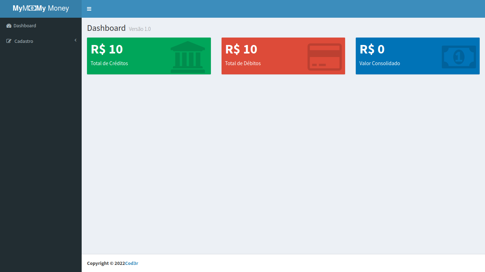

 

# Estudo da utilização dos principais fundamentos do React e Redux

Este projeto segue o curso de react <a href="https://www.udemy.com/course/react-redux-pt/">Curso React + Redux: Fundamentos e 2 Apps do Absoluto ZERO! | Udemy</a>

## Dependencias
| Recurso | Link |
| ------ | ------ |
| nodeJs |  https://nodejs.org/|
| MongoDB | https://www.mongodb.com |

## Para rodar a aplicação

- Para instalar os pacotes tanto na pasta backend, quanto nas pastas frontend
    
        npm install
    
- Para iniciar a aplicação backend
    
        npm run dev

- Para iniciar o frontend
        
        npm run dev

| Serviço | Link |
| ------ | ------ |
| Frontend | http://localhost:8080 |
| Backend | https://localhost:3003 |
